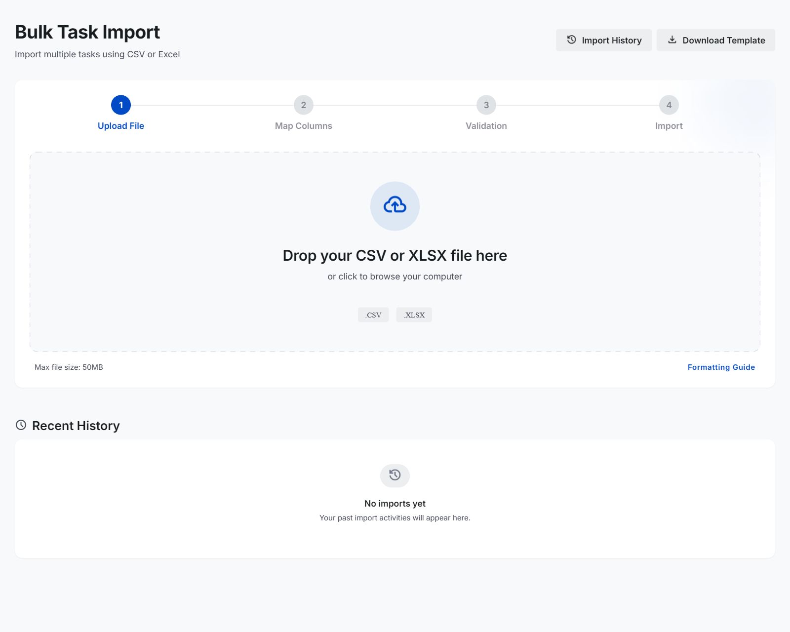
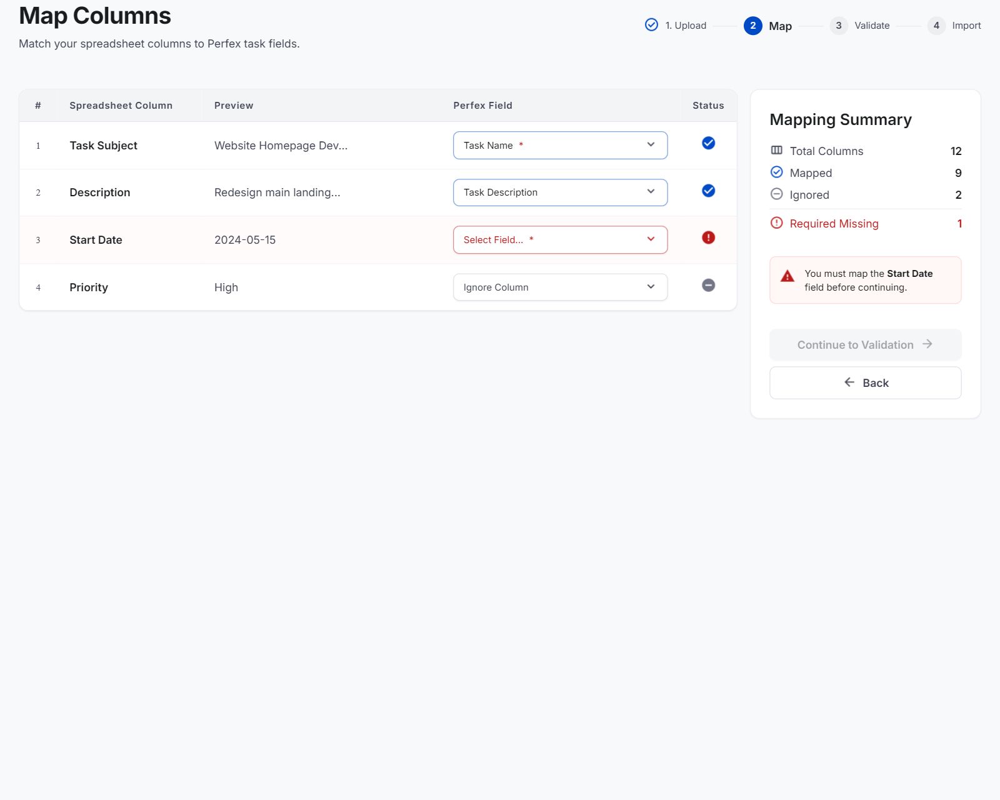
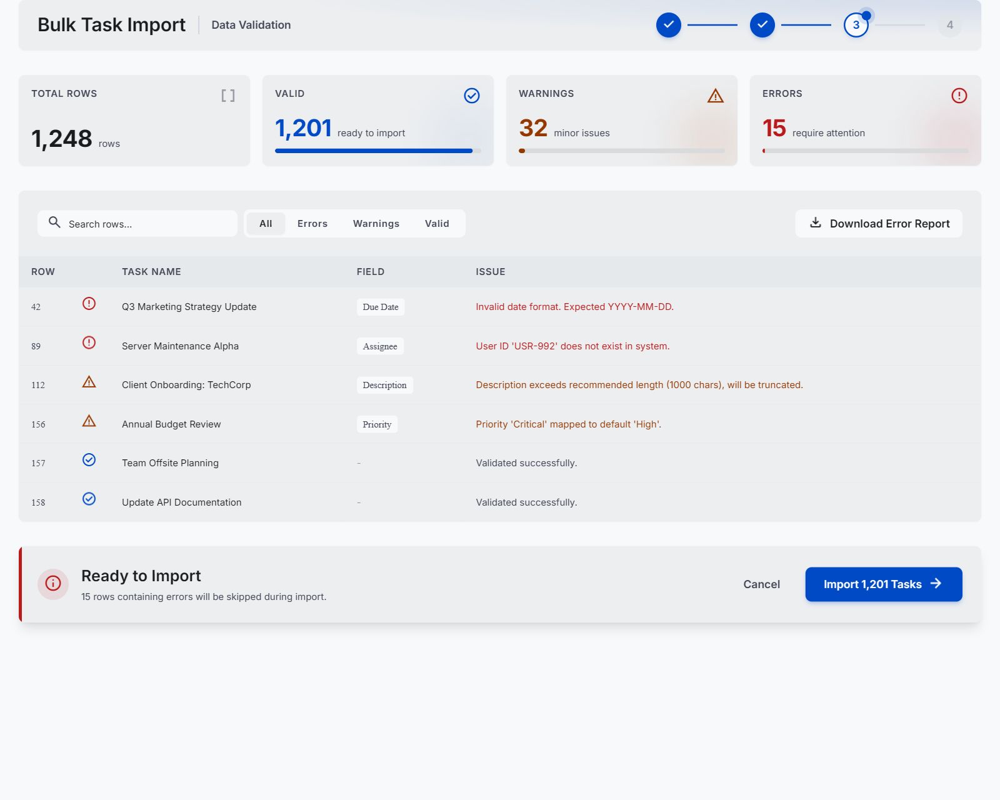
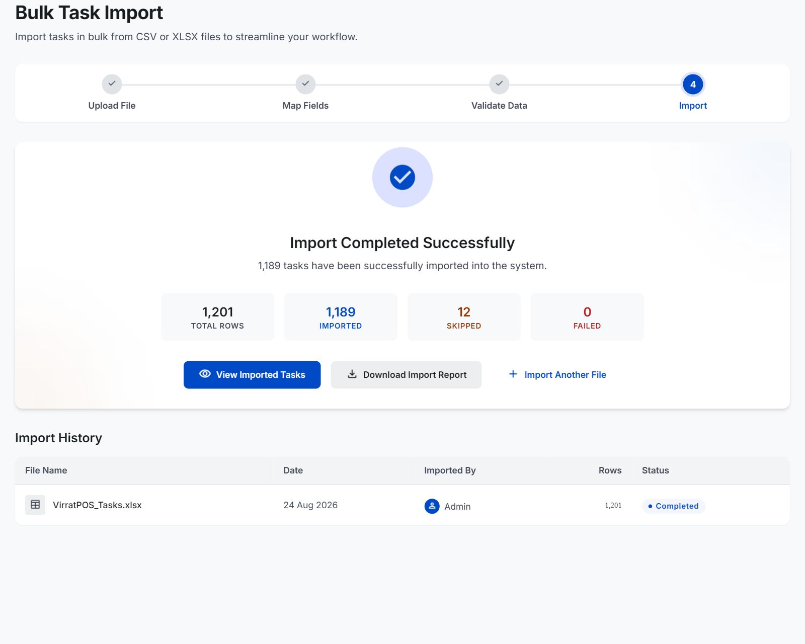

# Bulk Task Import for Perfex CRM

Install this folder as `modules/bulk_task_import` in a Perfex CRM installation using the documented module APIs. The module avoids a restrictive `Requires at least` header so Perfex can activate it across supported releases.

The module follows Perfex's module basics:

- `bulk_task_import.php` is the matching module init file.
- Activation creates only importer-management tables using `db_prefix()`.
- The admin menu and settings use Perfex hooks and helpers.
- The translation file is registered with Perfex's `register_language_files()` helper.
- Permission checks use Perfex staff capabilities.
- Task creation delegates to Perfex's existing `tasks_model`.
- Imported descriptions are passed as the normal `description` task field.
- Rollback only targets task IDs recorded for the selected import batch.

---

## 📸 Screenshots & Workflow Steps

Here is the step-by-step workflow of the importer:

### 1. Upload Spreadsheet
Upload your CSV or Excel (`.xlsx`) files. You can download the blank template directly from this screen. Additionally, you can associate all tasks with a specific project using the dropdown list.

### 2. Column Mapping
Map the headers from your uploaded file to the corresponding task fields in Perfex CRM (e.g., Subject, Description, Priority, Status, Assignees, Checklist Items). Click **Auto Map Columns** for fast mapping.

### 3. Validation Results
Review rows before importing. Succeeded tasks will be marked as **Valid**. Rows with missing required fields or incorrect data types will show warning/error alerts, and blocking errors will be skipped during insertion.

### 4. Completion & Summary
Once validation is confirmed, tasks are created along with their tags, assignees, and checklist subtasks (complete with individual subtask assignees). A final summary is shown with options to view the tasks or download report details.

---

## ⚙️ Configuration & XLSX Dependency

* **CSV Import**: Works out of the box without any external dependencies.
* **XLSX Support**: For Excel `.xlsx` files, ensure PhpSpreadsheet is installed and autoloaded. The reader handles missing libraries gracefully with clear warning notices.
* **Settings**: Configure maximum file size, duplicate detection, and batch size rules under **Setup > Settings > Bulk Task Import**.

---

## 🚀 Safe Rollout

1. Enable development mode on a staging Perfex installation.
2. Install and activate the module from **Setup > Modules**.
3. Assign View and Import permissions to a test staff role.
4. Import the template and confirm formatting.
5. Go to **Tasks > Bulk Import** to start importing your data!

*The module does not modify any Perfex core files.*